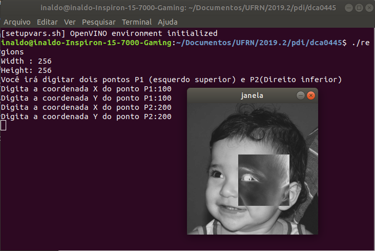
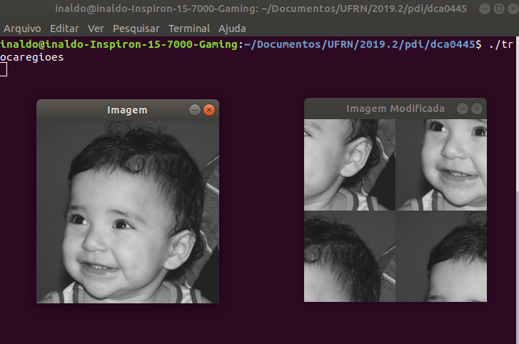
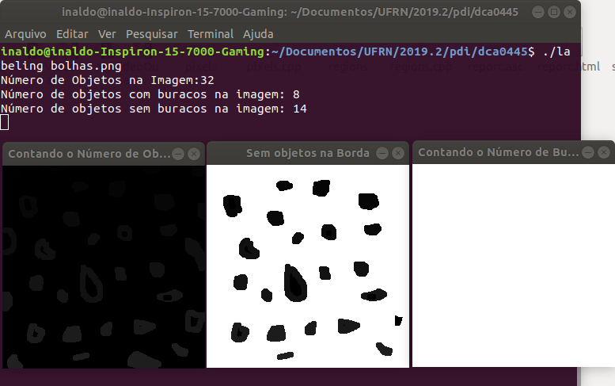
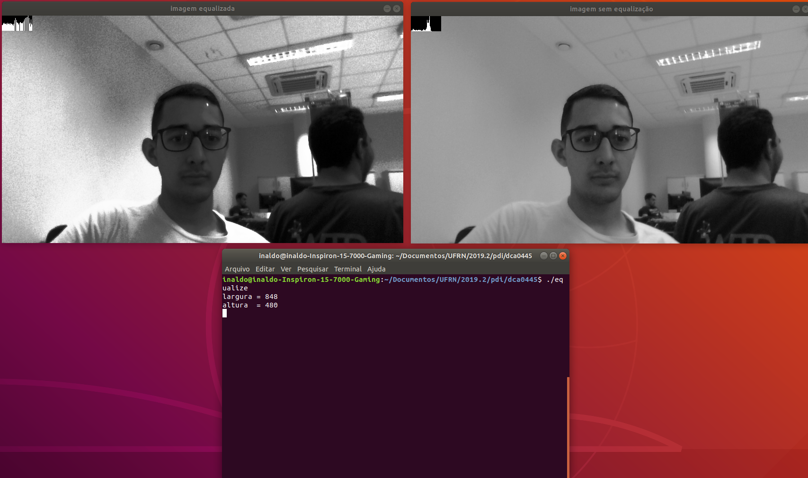
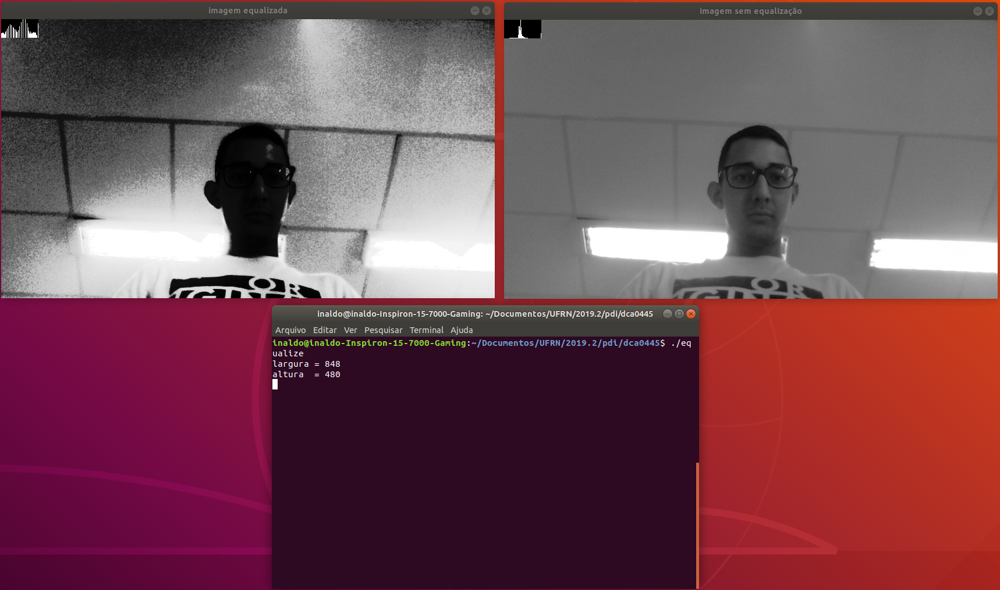
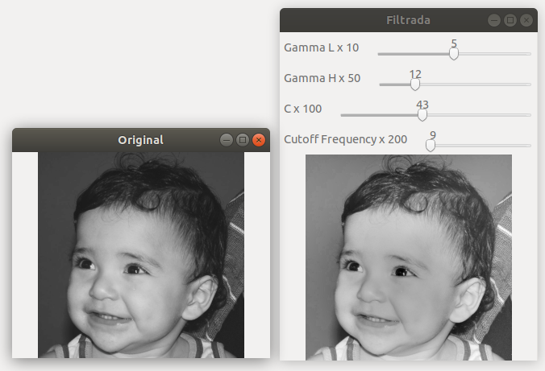
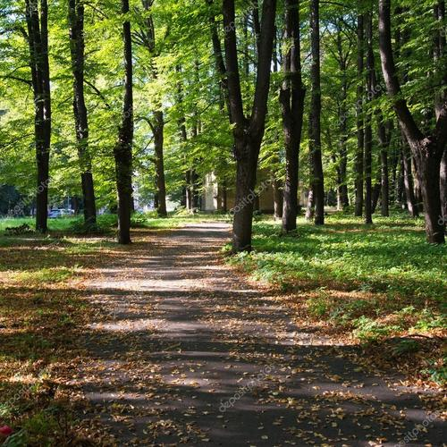
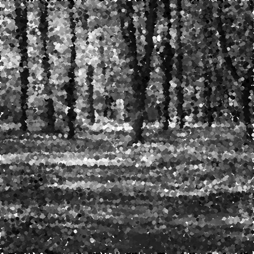
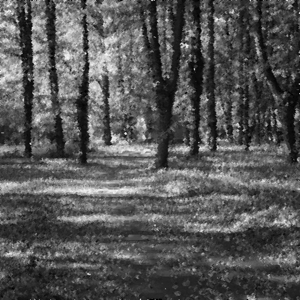

:source-highlighter: pygments
:toc: left
:stem:

= Processamento Digital de Imagens! =
Doc Writer <inaldomarinhoqueirozneto@gmail.com>

Este documento tem como objetivo mostrar os resultados e algoritmos obtidos a partir do link:https://agostinhobritojr.github.io/tutorial/pdi[roteiro] proposto pelo professor Agostinho Brito durante a disciplina Processamento Digital de Imagens ofertada de forma optativa pelo Departamento de Computação e Automação da UFRN.

== Unidade 1
=== Manipulando pixels em uma imagem

.Exercício 1
Esse programa deverá solicitar ao usuário as coordenadas de dois pontos P1 e P2 localizados dentro dos limites do tamanho da imagem e exibir que lhe for fornecida. Entretanto, a região definida pelo retângulo de vértices opostos definidos pelos pontos P1 e P2 será exibida com o negativo da imagem na região correspondente.

Para negativar a área desejada, bastou modificar os pixels da região selecionada fazendo o valor 255 menos o valor atual do pixel.

O efeito é ilustrado na Figura Regiões.

Segue o código link:codigos/regions.cpp[regions.cpp] que resolve a problemática do exercício 1.

[source,cpp]
.regions.cpp
----
#include <iostream>
#include <opencv2/opencv.hpp>
#include <highgui.h>

using namespace std;
using namespace cv;

int main(int, char**){
  Mat image;
  Vec3b val;

  image= imread("biel.png",CV_LOAD_IMAGE_GRAYSCALE);
  if(!image.data)
    cout << "nao abriu biel.png" << endl;

  cout << "Width : " << image.cols << endl;
  cout << "Height: " << image.rows << endl;

  int p1x, p1y, p2x, p2y;
  cout << "Você irá digitar dois pontos P1 (esquerdo superior) e P2(Direito inferior)"<< endl;
  cout << "Digita a coordenada X do ponto P1:";
  cin >> p1x;
  if(p1x < 0 || p1x > image.cols){
	cout << "Coordenada fora da imagem";
	return 0;
  }
  cout << "Digita a coordenada Y do ponto P1:";
  cin >> p1y;
  if(p1y < 0 || p1y > image.rows){
	cout << "Coordenada fora da imagem";
	return 0;
  }
  cout << "Digita a coordenada X do ponto P2:";
  cin >> p2x;
  if(p2x < 0 || p2x > image.cols){
	cout << "Coordenada fora da imagem";
	return 0;
  }
  cout << "Digita a coordenada Y do ponto P2:";
  cin >> p2y;
  if(p2y < 0 || p2y > image.rows){
	cout << "Coordenada fora da imagem";
	return 0;
  }

  if(p1x>p2x && p1y > p2y){
     int auxx, auxy;
     auxx = p1x;
     auxy = p1y;
     p1x = p2x;
     p1y = p2y;
     p2x = auxx;
     p2y = auxy;
  }
  else if (p1x>p2x || p1y > p2y){
	cout << "Coordenadas digitadas de forma inválida";
  }

  namedWindow("janela",WINDOW_AUTOSIZE);

  for(int i=p1y;i<p2y;i++){
    for(int j=p1x;j<p2x;j++){
      image.at<uchar>(i,j)= 255 - image.at<uchar>(i,j);
    }
  }

  imshow("janela", image);
  waitKey();

  return 0;
}
----

A <<figex1>> a saída do programa para a entrada da imagem biel.png, P1(100, 100) e P2(200, 200).

[[figex1, Figura 1]]
.Saída do programa regions.cpp

.Exercício 2

O programa link:codigos/trocaregioes.cpp[regions.cpp] troca os quadrantes em diagonal na imagem. Explorando o uso da classe Mat e seus construtores para criar as regiões que serão trocadas. O Código e o efeito produzido é ilustrado abaixo.

[source,cpp]
.trocaderegioes.cpp
----
#include <iostream>
#include <opencv2/opencv.hpp>
#include <highgui.h>

using namespace std;
using namespace cv;

int main(int, char**){
  Mat image, modificada, quadrante1, quadrante2, quadrante3, quadrante4;

  image= imread("biel.png",CV_LOAD_IMAGE_GRAYSCALE);
  if(!image.data)
    cout << "nao abriu biel.png" << endl;
  
  namedWindow("Imagem",WINDOW_AUTOSIZE);
  namedWindow("Imagem Modificada",WINDOW_AUTOSIZE);

  image.copyTo(modificada);

  quadrante1= image(Rect(0,image.cols/2,image.rows/2,image.cols/2));
  quadrante2= image(Rect(0,0,image.rows/2,image.cols/2));
  quadrante3= image(Rect(image.rows/2,0,image.rows/2,image.cols/2));
  quadrante4=  image(Rect(image.rows/2,image.cols/2,image.rows/2,image.cols/2));

  quadrante1.copyTo(modificada(Rect(image.rows/2,0,image.rows/2,image.cols/2)));
  quadrante2.copyTo(modificada(Rect(image.rows/2,image.cols/2,image.rows/2,image.cols/2)));
  quadrante3.copyTo(modificada(Rect(0,image.cols/2,image.rows/2,image.cols/2)));
  quadrante4.copyTo(modificada(Rect(0,0,image.rows/2,image.cols/2)));

  imshow("Imagem", image);
  imshow("Imagem Modificada", modificada);
  waitKey();

  imwrite("TrocaRegions.png", modificada);
  waitKey();

  return 0;
}
----
A <<figex2>> a saída do programa para a entrada da imagem biel.png.

[[figex2, Figura 2]]
.Saída do programa trocaderegioes.cpp

=== Preenchendo regiões
.Exercício 3

No exercício 3 inicialmente é solicitado a melhoria de um programa, que se encontra no roteiro da atividade, que conte mais que 255 objetos na imagem e para isso é feito um contador que conta quantas vezes ele passou de 254, pois assim, é possível encontrar o objeto se você buscar na mesma ordem que identificar.

Para remover os objetos da borda, foi dado um floodfill nos pixels da mesma na cor branca, assim deixando os objetos na cor cinza e os buracos dentro do mesmo preto. Em seguida, o algoritmo percorre a imagem procurando os objetos que possui uma região interna preta, incrementa o contador e remover esse objeto pintando de branco.

Para finalizar, ele realiza a contagem de quantos objetos restaram, que no caso, foram os objetos se buracos.

Segue o código link:codigos/labeling.cpp[labeling.cpp] que resolve os problemas do exercício 3.

[source,cpp]
.labeling.cpp
----
#include <iostream>
#include <opencv2/opencv.hpp>

using namespace cv;
using namespace std;
int main(int argc, char** argv){
  Mat image, mask;
  int width, height;
  int nobjects;
  CvPoint p;
  image = imread(argv[1],CV_LOAD_IMAGE_GRAYSCALE);

  if(!image.data){
    std::cout << "imagem nao carregou corretamente\n";
    return(-1);
  }
  width=image.size().width;
  height=image.size().height;

  p.x=0;
  p.y=0;

  int auxcont=0;
  // busca objetos na imagem
  nobjects=0;
  for(int i=0; i<height; i++){
    for(int j=0; j<width; j++){
      if(image.at<uchar>(i,j) == 255){
		// achou um objeto
		nobjects++;
		if (nobjects == 254){
			nobjects = 0;
			auxcont +=1;

                }
		p.x=j;
		p.y=i;
		floodFill(image,p,nobjects);
	  }
	}
  }

  cout << "Número de Objetos na Imagem:" << nobjects << endl;
  imshow("Contando o Número de Objetos", image);

	// retirando os objetos das bordas
   for(int i=0; i<width; i++){
        floodFill(image,Point(0, i), 255);
        floodFill(image,Point(height-1, i), 255);
  }

    for(int i=0; i<height; i++){
        floodFill(image,Point(i, 0), 255);
        floodFill(image,Point(i, width-1), 255);
  }

  imshow("Sem objetos na Borda", image);

  int nburaco=0;
 // contando quantos objetos tem buraco
  for(int i=0; i<height; i++){
    for(int j=0; j<width; j++){
      if(image.at<uchar>(i,j) == 0){
		// achou um objeto
		nburaco++;
		p.x=j;
		p.y=i;
		floodFill(image,p,255);
                p.x=j-1;
		p.y=i;
		floodFill(image,p,255);
	  }
	}
  }

  int semburaco=0;
  // contando quantidade de objetos com buraco
  for(int i=0; i<height; i++){
    for(int j=0; j<width; j++){
      if(image.at<uchar>(i,j) != 255){
		// achou um objeto
		semburaco++;
		p.x=j;
		p.y=i;
		floodFill(image,p,255);
	  }
	}
  }

  cout << "Número de objetos com buracos na imagem: "<< nburaco << endl;
  cout << "Número de objetos sem buracos na imagem: "<< semburaco << endl;

  imshow("Contando o Número de Buracos", image);

  //imwrite("labeling.png", image);
  waitKey();
  return 0;
}
----

A <<figex3>> a saída do programa para a entrada da imagem link:images/bolhas.png[bolhas.png].

[[figex3, Figura 3]]
.Saída do programa labeling.cpp

=== Manipulação de histogramas

.Exercício 4

* Exercício 4.1

O exercício solicita que a partir de um programa base fornecido no roteiro da atividade, desenvolver um outro programa que deverá, para cada imagem capturada, realizar a equalização do histogram antes de exibir a imagem. Assumindo que as imagens processadas serão em tons de cinza.

[source,cpp]
.equalize.cpp
----
#include <iostream>
#include <opencv2/opencv.hpp>

using namespace cv;
using namespace std;

int main(int argc, char** argv){
  Mat image, greyimage, greyimageeq;
  int width, height;
  VideoCapture cap;
  vector<Mat> planes;
  Mat comhist, semhist;
  int nbins = 64;
  float range[] = {0, 256};
  const float *histrange = { range };
  bool uniform = true;
  bool acummulate = false;

  cap.open(0);

  if(!cap.isOpened()){
    cout << "cameras indisponiveis";
    return -1;
  }

  int histw = nbins, histh = nbins/2;
  Mat histImgS(histh, histw, CV_8UC1, Scalar(0,0,0));
  Mat histImgC(histh, histw, CV_8UC1, Scalar(0,0,0));

  width  = cap.get(CV_CAP_PROP_FRAME_WIDTH);
  height = cap.get(CV_CAP_PROP_FRAME_HEIGHT);

  cout << "largura = " << width << endl;
  cout << "altura  = " << height << endl;

  while(1){
    cap >> image;
    cvtColor(image, greyimage, CV_BGR2GRAY);
    equalizeHist( greyimage, greyimageeq);
    calcHist(&greyimage, 1, 0, Mat(), semhist, 1,
             &nbins, &histrange,
             uniform, acummulate);
    calcHist(&greyimageeq, 1, 0, Mat(), comhist, 1,
             &nbins, &histrange,
             uniform, acummulate);

    normalize(semhist, semhist, 0, histImgS.rows, NORM_MINMAX, -1, Mat());
    normalize(comhist, comhist, 0, histImgC.rows, NORM_MINMAX, -1, Mat());

    histImgS.setTo(Scalar(0));
    histImgC.setTo(Scalar(0));

    for(int i=0; i<nbins; i++){
      line(histImgS,
           Point(i, histh),
           Point(i, histh-cvRound(semhist.at<float>(i))),
           Scalar(255), 1, 8, 0);
      line(histImgC,
           Point(i, histh),
           Point(i, histh-cvRound(comhist.at<float>(i))),
           Scalar(255), 1, 8, 0);
    }

    histImgS.copyTo(greyimage(Rect(0, 0,nbins, histh)));
    histImgC.copyTo(greyimageeq(Rect(0, 0,nbins, histh)));

    imshow("imagem equalizada", greyimageeq);
    imshow("imagem sem equalização", greyimage);
    waitKey(30);
  }
  return 0;
}
----

A <<figex4>> e <<figex5>> foram as saídas obtidas com o programa link:codigos/equalize.cpp[equalize.cpp] em locais com iluminações diferentes.

[[figex4, Figura 4]]
.Saída do programa equalize.cpp

[[figex5, Figura 5]]
.Saída do programa equalize.cpp

=== Filtragem no domínio espacial I

.Exercício 5

O exercício solicita que a partir de um programa base fornecido no roteiro da atividade como referência, implemente um outro programa link:codigos/laplgauss.cpp[laplgauss.cpp]. O programa deverá acrescentar mais uma funcionalidade ao exemplo fornecido, permitindo que seja calculado o laplaciano do gaussiano das imagens capturadas.

Para isso, foi adicionado ao código mais uma opção no switch no qual ao ser selecionada passara o filtro gaussiano e em seguida o laplaciano. Para a criação dessa lógica foi necessário fazer uma variável boleana que salve o estado se é para passar o filtro laplaciano ou não.

O código completo se encontra abaixo.
[source,cpp]
.laplgauss.cpp
----
#include <iostream>
#include <opencv2/opencv.hpp>

using namespace cv;
using namespace std;

void printmask(Mat &m){
  for(int i=0; i<m.size().height; i++){
    for(int j=0; j<m.size().width; j++){
      cout << m.at<float>(i,j) << ",";
    }
    cout << endl;
  }
}

void menu(){
  cout << "\npressione a tecla para ativar o filtro: \n"
	"a - calcular modulo\n"
    "m - media\n"
    "g - gauss\n"
    "v - vertical\n"
	"h - horizontal\n"
    "l - laplaciano\n"
    "j - laplaciano do gaussiano\n"
	"esc - sair\n";
}

int main(int argvc, char** argv){
  VideoCapture video;
  float media[] = {1,1,1,
				   1,1,1,
				   1,1,1};
  float gauss[] = {1,2,1,
				   2,4,2,
				   1,2,1};
  float horizontal[]={-1,0,1,
					  -2,0,2,
					  -1,0,1};
  float vertical[]={-1,-2,-1,
					0,0,0,
					1,2,1};
  float laplacian[]={0,-1,0,
					 -1,4,-1,
					 0,-1,0};

  Mat cap, frame, frame32f, frameFiltered;
  Mat mask(3,3,CV_32F), mask1;
  Mat result, result1;
  double width, height, min, max;
  int absolut;
  char key;

  video.open(0);
  if(!video.isOpened())
    return -1;
  width=video.get(CV_CAP_PROP_FRAME_WIDTH);
  height=video.get(CV_CAP_PROP_FRAME_HEIGHT);
  std::cout << "largura=" << width << "\n";;
  std::cout << "altura =" << height<< "\n";;

  namedWindow("filtroespacial",1);

  mask = Mat(3, 3, CV_32F, media);
  scaleAdd(mask, 1/9.0, Mat::zeros(3,3,CV_32F), mask1);
  swap(mask, mask1);
  absolut=1; // calcs abs of the image
  bool laplaciano = false;
  menu();
  for(;;){
    video >> cap;
    cvtColor(cap, frame, CV_BGR2GRAY);
    flip(frame, frame, 1);
    imshow("original", frame);
    frame.convertTo(frame32f, CV_32F);
    filter2D(frame32f, frameFiltered,
			 frame32f.depth(), mask, Point(1,1), 0);

    if(laplaciano){
      mask = Mat(3, 3, CV_32F, laplacian);
      filter2D(frameFiltered, frameFiltered,
			 frameFiltered.depth(), mask, Point(1,1), 0);
      //printmask(mask);
    }
    if(absolut){
      frameFiltered=abs(frameFiltered);
    }
    frameFiltered.convertTo(result, CV_8U);
    imshow("filtroespacial", result);
    key = (char) waitKey(10);
    if( key == 27 ) break; // esc pressed!
    switch(key){
    case 'a':
	  menu();
      absolut=!absolut;
      laplaciano = false;
      break;
    case 'm':
	  menu();
      mask = Mat(3, 3, CV_32F, media);
      scaleAdd(mask, 1/9.0, Mat::zeros(3,3,CV_32F), mask1);
      mask = mask1;
      printmask(mask);
      laplaciano = false;
      break;
    case 'g':
	  menu();
      mask = Mat(3, 3, CV_32F, gauss);
      scaleAdd(mask, 1/16.0, Mat::zeros(3,3,CV_32F), mask1);
      mask = mask1;
      printmask(mask);
      laplaciano = false;
      break;
    case 'h':
	  menu();
      mask = Mat(3, 3, CV_32F, horizontal);
      printmask(mask);
      laplaciano = false;
      break;
    case 'v':
	  menu();
      mask = Mat(3, 3, CV_32F, vertical);
      printmask(mask);
      laplaciano = false;
      break;
    case 'l':
	  menu();
      mask = Mat(3, 3, CV_32F, laplacian);
      printmask(mask);
      laplaciano = false;
      break;
    case 'j':
	menu();
      mask = Mat(3, 3, CV_32F, gauss);
      scaleAdd(mask, 1/16.0, Mat::zeros(3,3,CV_32F), mask1);
      mask = mask1;
      laplaciano = true;
      break;
    default:
      break;
    }
  }
  return 0;
}
----

== Unidade 2
=== Filtragem no domínio da frequência

.Exercício 7 

A partir do programa link:codigos/dft.cpp[dft.cpp], fornecido no roteiro da atividade, foi proposto a implementação de um filtro homomórfico, que tem como objetivo corrigir a iluminação em imagens irregulares.

Sabemos que a imagem é composta  por duas funções de iluminação e reflectância, sabemos também que a iluminação possui uma variação sutil, assim, a mesma é representada pelas componentes de baixa frequência. Sabendo disso, o filtro homomórfico consiste em separar as componentes de iluminação e reflectância, remover essas componentes de baixa frequência a fim de melhorar a iluminação da imagem. Para isso, fazemos o logaritmo da imagem, a fim de separar iluminação e reflectancia, levamos a imagem para o domínio da frequência, removemos as componentes de baixa frequência utilizando o filtro homomórfico e realizamos a transformada inversa e tiramos a exponencial para remover o logaritmo. 

O código se encontra todo comentado e explicando o passo a passo da implementação.

O código link:codigos/fHomomorfico.cpp[fHomomorfico.cpp] completo se encontra abaixo.
[source,cpp]
.fHomomorfico.cpp
----

#include <iostream>
#include <opencv2/opencv.hpp>
#include <opencv2/imgproc/imgproc.hpp>

#define RADIUS 20

using namespace cv;
using namespace std;

  // definindo variaveis como globais -----------------------------
Mat imaginaryInput, complexImage, multsp;
  Mat padded, filter, mag;
  Mat image, tmp; 
  Mat_<float> realInput, zeros;
  vector<Mat> planos;
  int gammaL, gammaH, sharpC, cutoff;

  // valor do ruido
  float mean;

  // guarda tecla capturada
  char key;

  // valores ideais dos tamanhos da imagem
  // para calculo da DFT
  int dft_M, dft_N;

  // inicializa as variaveis dos sliders
int gammaL_slider = 9, gammaH_slider = 34, sharpC_slider = 53, cutoff_slider = 16;
const int gammaL_max = 10, gammaH_max = 50, sharpC_max = 100, cutoff_max = 200;
// -----------------------------------------------------

// troca os quadrantes da imagem da DFT
void deslocaDFT(Mat& image ){
  Mat tmp, A, B, C, D;

  // se a imagem tiver tamanho impar, recorta a regiao para
  // evitar cópias de tamanho desigual
  image = image(Rect(0, 0, image.cols & -2, image.rows & -2));
  int cx = image.cols/2;
  int cy = image.rows/2;
  
  // reorganiza os quadrantes da transformada
  // A B   ->  D C
  // C D       B A
  A = image(Rect(0, 0, cx, cy));
  B = image(Rect(cx, 0, cx, cy));
  C = image(Rect(0, cy, cx, cy));
  D = image(Rect(cx, cy, cx, cy));

  // A <-> D
  A.copyTo(tmp);  D.copyTo(A);  tmp.copyTo(D);

  // C <-> B
  C.copyTo(tmp);  B.copyTo(C);  tmp.copyTo(B);
}

// função que prepara o filtro homomorfico baseado nos parametros gl, gh, c, d0
Mat homomorphicFilter(double gl, double gh, double c, double d0){
  Mat filter = Mat(padded.size(), CV_32FC2, Scalar(0));
  Mat tmp = Mat(dft_M, dft_N, CV_32F);
  
  for(int i=0; i<dft_M; i++){
    for(int j=0; j<dft_N; j++){
      tmp.at<float> (i,j) = (gh - gl)*(1 - exp(-c*(( (i-dft_M/2)*(i-dft_M/2) + (j-dft_N/2)*(j-dft_N/2) ) / (d0*d0) ))) + gl;
    }
  }

  Mat comps[]= {tmp,tmp};
  merge(comps, 2, filter);
  return filter;
}

Mat filtragemHomomorfica(){

    // realiza o padding da imagem
    copyMakeBorder(image, padded, 0,
                   dft_M - image.rows, 0,
                   dft_N - image.cols,
                   BORDER_CONSTANT, Scalar::all(0));

    // limpa o array de matrizes que vao compor a
    // imagem complexa
    planos.clear();
    // cria a compoente real
    realInput = Mat_<float>(padded);

    // adiciona 1 a cada pixel da imagem para não haver log de 0
    realInput += Scalar::all(1);
    
    // realiza o log da imagem
    log(realInput,realInput);

    // insere as duas componentes no array de matrizes
    planos.push_back(realInput);
    planos.push_back(zeros);

    // combina o array de matrizes em uma unica
    // componente complexa
    merge(planos, complexImage);

    // calcula o dft
    dft(complexImage, complexImage);

    // realiza a troca de quadrantes
    deslocaDFT(complexImage);
    
    // filtro homomorfico    
    Mat filter = homomorphicFilter(gammaL,gammaH,sharpC,cutoff);

    // aplica o filtro homomorfico
    mulSpectrums(complexImage,filter,complexImage,0);

    // limpa o array de planos
    planos.clear();
    // separa as partes real e imaginaria para modifica-las
    split(complexImage, planos);
 
    // recompoe os planos em uma unica matriz complexa
    merge(planos, complexImage);

    // troca novamente os quadrantes
    deslocaDFT(complexImage);

	
    // calcula a DFT inversa
    idft(complexImage, complexImage);

    // limpa o array de planos
    planos.clear();

    // separa as partes real e imaginaria da
    // imagem filtrada
    split(complexImage, planos);

    // normaliza a parte real para exibicao
    normalize(planos[0], planos[0], 0, 1, CV_MINMAX);
    return planos[0];
}
void on_trackbar(int, void*){
  gammaL = (double) gammaL_slider/10;
  gammaH = (double) gammaH_slider/10;
  sharpC = (double) sharpC_slider;
  cutoff = (double) cutoff_slider;
  tmp = filtragemHomomorfica();
  imshow("Filtrada", tmp);
}
int main(int argc, char** argv){
  
  namedWindow("Filtrada", WINDOW_KEEPRATIO);
  namedWindow("Original", WINDOW_KEEPRATIO);
    
  // ler a imagem
  image = imread(argv[1], CV_LOAD_IMAGE_GRAYSCALE);

  imshow("Original",image);

  // identifica os tamanhos otimos para
  // calculo do FFT
  dft_M = getOptimalDFTSize(image.rows);
  dft_N = getOptimalDFTSize(image.cols);

  // realiza o padding da imagem
  copyMakeBorder(image, padded, 0,
                 dft_M - image.rows, 0,
                 dft_N - image.cols,
                 BORDER_CONSTANT, Scalar::all(0));

  // parte imaginaria da matriz complexa (preenchida com zeros)
  zeros = Mat_<float>::zeros(padded.size());

  // prepara a matriz complexa para ser preenchida
  complexImage = Mat(padded.size(), CV_32FC2, Scalar(0));

  // a função de transferência (filtro frequencial) deve ter o
  // mesmo tamanho e tipo da matriz complexa
  filter = complexImage.clone();

  // cria uma matriz temporária para criar as componentes real
  // e imaginaria do filtro ideal
  tmp = Mat(dft_M, dft_N, CV_32F);

  // cria a matriz com as componentes do filtro e junta
  // ambas em uma matriz multicanal complexa
  Mat comps[]= {tmp, tmp};
  merge(comps, 2, filter);

  char Name[50];

  sprintf( Name, "Gamma L x %d", gammaL_max );
  createTrackbar( Name, "Filtrada", &gammaL_slider, gammaL_max, on_trackbar);

  sprintf( Name, "Gamma H x %d", gammaH_max );
  createTrackbar( Name, "Filtrada", &gammaH_slider, gammaH_max, on_trackbar);

  sprintf( Name, "C x %d", sharpC_max );
  createTrackbar( Name, "Filtrada", &sharpC_slider, sharpC_max, on_trackbar);
  
  sprintf( Name, "Cutoff Frequency x %d", cutoff_max );
  createTrackbar( Name, "Filtrada", &cutoff_slider, cutoff_max, on_trackbar);
  

  waitKey(0);
  return 0;
}

----
Abaixo segue o resultado do código para a figura link:images/biel.png[biel.png], que também se encontra no roteiro da atividade, com os parametros gammaL = 5, gammaH = 10, sharpC = 43 e cutoff = 9.
 
[[figex6, Figura 6]]
.Saída do programa fHomomorfico.cpp

=== Pontilhismo
.Exercício 8

Nesse exercício foi prosposto utilizar o código link:codigos/canny.cpp[canny.cpp], fornecido no roteiro da atividade, para aprimorar o código link:codigos/pontilhismo.cpp[pontilhismo.cpp] e gerar uma imagem pontilhista artificial melhorada.

Para isso, eu utilizei a imagem gerada pelo código canny com vários limiares, e percorria esse imagem percebendo onde havia transição de pixel, ou seja, borda. A medida que o limiar ia aumentado eu ia aumentando o tamanho do raio a ser desenhado. O que eu fiz, foi um aprimoramento do código, assim adicionando ao código pontilhismo essa operação.

[source,cpp]
.Parte Adicionada ao Código
----
  imwrite("pontosantes.jpg", points);
  int intervalos[5] = {5, 50, 500, 550, 600};
    for(int k = 0; k<5; k++){
      Canny(image, border, intervalos[k], 3*intervalos[k]);
        for(int i=0;i<height;i++){
          for(int j=1;j<width;j++){
	    if (border.at<uchar>(j,i) == 255 and border.at<uchar>(j-1,i) == 0){
		    gray = image.at<uchar>(j,i);
		    circle(points,
		      cv::Point(i,j),
			     k+1,
			     CV_RGB(gray,gray,gray),
			     -1,
			     CV_AA);
	     }
          }
       }
    }
----
Caso queira modificar os limiares do algoritmo canny, basta modificar o array "intervalos", que possui cinco posições cada posição representa o valor do raio da bola (1[primeira],2,3,4,5[última]). 

O código link:codigos/cannypoints.cpp[cannypoints.cpp] completo se encontra abaixo.
[source,cpp]
.cannypoints.cpp
----
#include <iostream>
#include <opencv2/opencv.hpp>
#include <fstream>
#include <iomanip>
#include <vector>
#include <algorithm>
#include <numeric>
#include <ctime>
#include <cstdlib>

using namespace std;
using namespace cv;

#define STEP 3
#define JITTER 5
#define RAIO 3

int main(int argc, char** argv){
  vector<int> yrange;
  vector<int> xrange;

  Mat image, frame, points, border;

  int width, height, gray;
  int x, y;
  
  image= imread(argv[1],CV_LOAD_IMAGE_GRAYSCALE);

  srand(time(0));
  
  if(!image.data){
	cout << "nao abriu" << argv[1] << endl;
    cout << argv[0] << " imagem.jpg";
    exit(0);
  }

  width=image.size().width;
  height=image.size().height;

  xrange.resize(height/STEP);
  yrange.resize(width/STEP);
  
  iota(xrange.begin(), xrange.end(), 0); 
  iota(yrange.begin(), yrange.end(), 0);

  for(uint i=0; i<xrange.size(); i++){
    xrange[i]= xrange[i]*STEP+STEP/2;
  }

  for(uint i=0; i<yrange.size(); i++){
    yrange[i]= yrange[i]*STEP+STEP/2;
  }
  
  points = Mat(height, width, CV_8U, Scalar(255));

  random_shuffle(xrange.begin(), xrange.end());
  
  for(auto i : xrange){
    random_shuffle(yrange.begin(), yrange.end());
    for(auto j : yrange){
      x = i+rand()%(2*JITTER)-JITTER+1;
      y = j+rand()%(2*JITTER)-JITTER+1;
      gray = image.at<uchar>(x,y);
      circle(points,
             cv::Point(y,x),
             RAIO,
             CV_RGB(gray,gray,gray),
             -1,
             CV_AA);
    }
  }
  imwrite("pontosantes.jpg", points);
  int intervalos[5] = {5, 50, 500, 550, 600};
    for(int k = 0; k<5; k++){
      Canny(image, border, intervalos[k], 3*intervalos[k]);
        for(int i=0;i<height;i++){
          for(int j=1;j<width;j++){
	    if (border.at<uchar>(j,i) == 255 and border.at<uchar>(j-1,i) == 0){
		    gray = image.at<uchar>(j,i);
		    circle(points,
		      cv::Point(i,j),
			     k+1,
			     CV_RGB(gray,gray,gray),
			     -1,
			     CV_AA);
	     }
          }
       }
    }
  imwrite("pontos.jpg", points);
  return 0;
}
----

[[figex7, Figura 7]]
.Figura de entrada

[[figex8, Figura 8]]
.Saída do programa pontilhismo.cpp

[[figex9, Figura 9]]
.Saída do programa cannypoints.cpp

